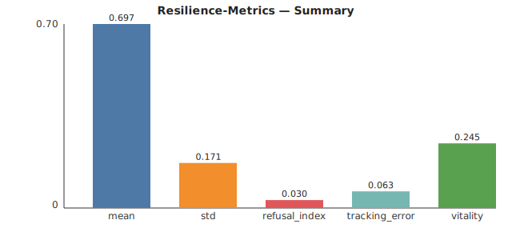

# Resilience-Metrics

## Understand Your System's Stability, Quantified.

**Is your system robust? Can it handle shocks? Resilience-Metrics is a Docker-ready command-line tool that analyzes time-series data to provide clear, quantitative metrics on your system's stability and resilience.** Go from raw data to actionable insights with a single command.

---

### Key Benefits

*   **Objective & Repeatable:** Replace guesswork with hard numbers. Compare stability scores before and after changes.
*   **Universal Application:** Works on any time-series data: server response times, IoT sensor data, financial metrics, robotics, and more.
*   **Simple & Scriptable:** A clean CLI that easily integrates into your monitoring and data analysis pipelines.

---

### Try with Docker

```bash
docker run --rm -v "$PWD/examples":/data eliotsystem/resilience-metrics:latest analyze --csv /data/synth.csv --out /data/analysis.json
```

---

### Visual Proof

The analysis can be visualized as a self-contained SVG summary.



---

### Data Proof (JSON Output)

The tool generates a clean, machine-readable JSON report with key resilience scores.

```json
{
  "summary": {
    "value": {
      "refusal_index": 0.03,
      "tracking_error": 0.0603,
      "vitality": 0.2409
    }
  }
}
```
*(Excerpt from a sample report)*

---

### License

This software is provided "as-is". Please see the [End-User License Agreement](EULA.md) for full terms of use.
