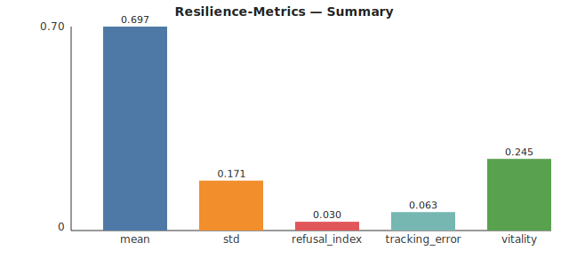

# Resilience-Metrics

A tool for analyzing time-series data to quantify system resilience. Packaged for easy, professional deployment via Docker.

## Quickstart with Docker

Run the CLI on the included synthetic example:

```
docker run --rm -v "$PWD/examples":/data \
  [User-Name]/resilience-metrics:latest \
  analyze --csv /data/synth.csv --out /data/analysis.json
```

### From Quickstart to Results (copy/paste)

1) Be in the project root so that `examples/` exists:

```
cd /path/to/resilience-metrics
```

2) Run the analysis (creates `analysis.json` next to the input):

```
docker run --rm -v "$PWD/examples":/data \
  [User-Name]/resilience-metrics:latest \
  analyze --csv /data/synth.csv --out /data/analysis.json
```

3) Optional: create visual summaries from `analysis.json`:

```
python examples/quick_svg.py   # writes examples/summary.svg
python examples/quick_png.py   # writes examples/summary.png
```

Notes
- The `-v "$PWD/examples":/data` mount means the container sees your local `examples/` as `/data`.
- CSV must have headers; use `--columns value1,value2` to restrict analysis to specific numeric columns.
- Filenames are case‑sensitive on Linux.
- If no numeric columns are found (or after `--columns` filtering), the CLI fails with a clear error instead of a blank report.

## Example Output

The analysis produces a JSON report with key resilience metrics. Visual summaries are provided in the `examples/` folder.

**SVG summary**



**PNG summary**


`analysis.json` (excerpt):

```
{
  "columns": ["value"],
  "summary": {
    "value": {
      "count": 200,
      "mean": 0.70,
      "std": 0.17,
      "min": 0.29,
      "max": 1.06,
      "p05": 0.44,
      "p95": 0.99,
      "band": [0.36, 1.04],
      "refusal_index": 0.03,
      "tracking_error": 0.06,
      "vitality": 0.24
    }
  }
}
```

Short descriptions:
- `refusal_index`: fraction of points outside the ±2σ band around the mean.
- `tracking_error`: average absolute step `abs(diff(x))`.
- `vitality`: dispersion relative to |mean| (`std / (|mean|+1e-6)`).

## Known limitations (v0.1.x)

- Assumes numeric columns with simple statistics; non‑numeric columns are skipped.
- No gap imputation; missing values (NaN) are ignored in metrics.
- Interpretation depends on domain scaling; consider normalization before analysis.

## License

This software is provided "as-is". Please see the [End-User License Agreement](./EULA.md) for terms of use.
